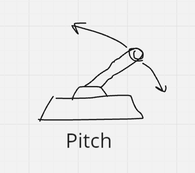
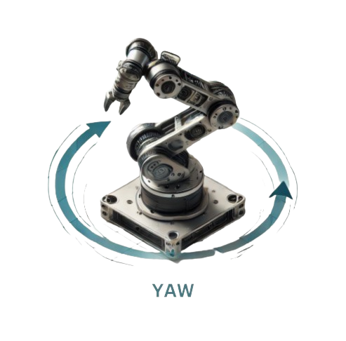

# Embedded-Week-5

Last week you worked on the motor chassis controls which is the bottom half of the robots. This week we will take a look at the top half movements(Pitch, Yaw, Shoot).

## Pitch

Pitch refers to the up and down movement of the robot's top half. This movement is typically controlled by rotating the structure around a horizontal axis. In robotics, pitch control is crucial for tasks that require precise vertical alignment, such as adjusting the angle of a camera or arm. When you control the pitch, you're essentially changing the tilt of the robot's head or the angle of an attachment.



### Sample Implementation

```cpp
//Instantiate Pitch
DJIMotor pitch(7, CANHandler::CANBUS_2, GIMBLY,"Peach");
```

```cpp
if(pitch_enabled){
    // Update the desired pitch angle based on user inputs
    desiredPitch += remote.getMouseY() * MOUSE_SENSE_PITCH;
    
    // Decrease desiredPitch by the left joystick's value scaled by a sensitivity constant
    desiredPitch -= leftStickValue * JOYSTICK_SENSE_PITCH;
    // Constrain desiredPitch within the specified bounds
    if (desiredPitch >= LOWERBOUND) {
        // printff("u%f\n",desiredPitch);
        desiredPitch = LOWERBOUND;
    }
    else if (desiredPitch <= UPPERBOUND) {
        // printff("d%f\n",desiredPitch);
        desiredPitch = UPPERBOUND;
    }

    // Calculate the feedforward term for the PID controller
    float FF = K * sin((desiredPitch / 180 * PI) - pitch_phase); // output: [-1,1]
    // Set the feedforward value in the pitch PID controller
    pitch.pidPosition.feedForward = int((INT16_T_MAX) * FF);
    // Set the pitch motor to move to the desired position
    pitch.setPosition(int((desiredPitch / 360) * TICKS_REVOLUTION + InitialOffset_Ticks));

} else{
    // If the control is disabled, set the pitch motor power to zero
    pitch.setPower(0);
}
```

## Yaw

Yaw refers to the left and right rotation of the robot's top half around a vertical axis. This movement allows the robot to turn and face different directions without changing its location. Yaw is essential for navigation, aiming, and any situation where the robot needs to adjust its orientation relative to its surroundings.


### Sample Implementation

```cpp
//Instantiate Yaw
DJIMotor yaw(5, CANHandler::CANBUS_1, GIMBLY,"Yeah");
```

```cpp
// Decrease yawSetPoint by the mouse's horizontal movement scaled by a sensitivity constant
yawSetPoint -= remote.getMouseX() * MOUSE_SENSE_YAW;
// Check if the right joystick's X-axis input exceeds a deadzone threshold
if(remote.rightX() > 10 || remote.rightX() < -10){
    // Decrease yawSetPoint by the right joystick's X-axis input scaled by a sensitivity constant
    yawSetPoint -= remote.rightX() * JOYSTICK_SENSE_YAW;
}
```

## Conclusion

Both pitch and yaw are part of the robot's degrees of freedom, which allow it to interact with its environment in more complex ways. Understanding how to control these movements is fundamental for operating the robot effectively in various tasks.

## Shooting

In order for us to shoot, we use a indexer to store our bullets and feed it into a tube which then will use two flywheels to launch the ball out of the barrel.

Note: Everytime when we shoot a bullet the barrel will "heat up". If we go over a certain threshold then we will loose HP during the match against our opponents. This means that we are not able to spam shots so we would have to develope some sort of timer/buffer that prevents our barrel from overheating.

### Instantiating Fly Wheel and Indexer (Infantry)

```p
//Instantiate Indexer, R&L Flywheel
DJIMotor indexer(7, CANHandler::CANBUS_2, C610,"Indexer");
DJIMotor RFLYWHEEL(8, CANHandler::CANBUS_2, M3508,"RightFly");
DJIMotor LFLYWHEEL(5, CANHandler::CANBUS_2, M3508,"LeftFly");
```

The code below shows how we implemented the shooting algorithm.

First, inside the refloop we uses the left switch of our remote to do all the shooting stuff. To begin with the last statement which turns our fly wheel off when the left switch is in DOWN mode. This is the base state where you don't want to shoot. If you move the left switch to MID, it turns on the two fly wheels. This is where you are preparing to shoot. Lastly if you turn the state to UP then you are shooting. Bullets will only come out if you're not on cooldown. Switch between UP and MID for optimal performance.

```cpp
// Check if the left switch is in the UP position or the left mouse button is pressed
if (remote.leftSwitch() == Remote::SwitchState::UP || remote.getMouseL()){
                // If the system is ready to shoot
                if (shootReady){
                    shootReady = false;
                    // shoot = true;
                    // Calculate the target position for the indexer to shoot
                    shootTargetPosition = 8192 * 12 + (indexer>>MULTITURNANGLE);

                    // Check if shooting is allowed based on heat limits
                    if(robot_status.shooter_barrel_heat_limit < 10 || power_heat_data.shooter_17mm_1_barrel_heat < robot_status.shooter_barrel_heat_limit - 40) {
                        shoot = true;
                    }
                  
                }
            } else {
                //SwitchState state set to mid/down/unknown
                shootReady = true;
            }
            // Control the flywheels based on the left switch position
            if (remote.leftSwitch() != Remote::SwitchState::DOWN &&
                remote.leftSwitch() != Remote::SwitchState::UNKNOWN){
                // If the left switch is in UP or MID position
                // Turn on the flywheels at specified speeds
                RFLYWHEEL.setSpeed(7000);
                LFLYWHEEL.setSpeed(-7000);
            } else{
                // If the left switch is DOWN or UNKNOWN
                // Turn off the flywheels
                RFLYWHEEL.setSpeed(0);
                LFLYWHEEL.setSpeed(0);
            }
```

## Assignment #1

For this assignment, we're going to focus on controlling the movement of the robot's upper half—specifically, the pitch and yaw mechanisms. The controls will be connected to the right switch on your remote.

Your task is to instantiate both the yaw and pitch motors using the examples provided earlier. Using the right joystick, you'll control these movements: pushing left and right (negative and positive X positions) will rotate the yaw, allowing the robot to spin left and right. Pushing up and down (negative and positive Y positions) will adjust the pitch, moving the robot's upper half up and down.

By the end of this assignment, the robot should be able to complete a full rotation in both directions for yaw, and you should be able to change the position of the pitch. You can optionally add PID control values to make the movements smoother.

As before, starting code is provided in the assignment files. Remember to use CANBUS 2 for all the motors since we're working on the upper half of the robot.

## Assignment #2

For this assignment, we'll be focusing on the shooting mechanism of our robot. The controls will be tied to the left switch, which has three states: UP, MID, and DOWN. We'll be working with the flywheels and the indexer to make this happen.

In the DOWN position, the robot should enter an "off" mode where the flywheels are turned off. When the switch is in the MID position, both flywheels should turn on and get ready to shoot. Finally, in the UP position, the robot should shoot the balls using the indexer.

Your task is to implement the indexer and flywheel controls according to the logic above. Additionally, you need to implement a timer or cooldown mechanism that makes the robot shoot 3 balls at a time.

As before, starting code is provided in the assignment files. Remember to use CANBUS 2 for all the motors since we're working on the upper half of the robot.

Note: 

Test in person with robots.
